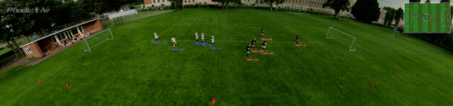
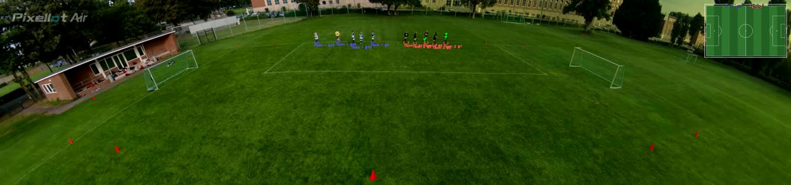
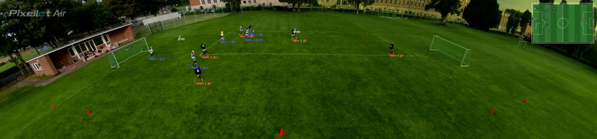

# Football Inference

Inference-only pipeline for football match video analysis: **object detection**
(YOLO + SAHI tiling), **multi-object tracking** (ByteTrack), **team assignment**
by jersey color clustering, and **2D minimap projection**. This is a standalone
copy of the `Football_detection` pipeline — no training code, dataset, or tests
included, and it does not import from `Football_detection`.

The model detects and tracks 2 base classes:

0 - Ball
1 - Player

Players are further split into **Team A** / **Team B** by jersey color, with
each tracked player projected onto a bird's-eye minimap of the pitch.

## Demo



## Quick Guide

<details><summary>Install</summary>

```bash
python3 -m venv .venv
source .venv/bin/activate
pip install -r requirements.txt
```

</details>

<details><summary>Inference on video</summary>

```bash
python scripts/run_pipeline.py \
  --source path/to/video.mp4 \
  --output output.mp4 \
  --config config.football_yolo.yaml
```

`config.football_yolo.yaml` and `config.yaml` both point at the trained
checkpoint in `data/weights/football_yolo.pt` (classes: `0: ball`, `1: player`).
`minimap.source_keypoints` and `detection.roi_polygon` in the configs are
calibrated for the original camera/video — recalibrate them if you point this
at footage from a different camera angle.

</details>

<details><summary>Run with Docker</summary>

```bash
docker build -t football-inference .
docker run --rm -v "$(pwd)":/data football-inference \
  --source /data/path/to/video.mp4 \
  --output /data/output.mp4 \
  --config config.football_yolo.yaml
```

The image is CPU-only (`python:3.11-slim` + CPU-build PyTorch) and already
bundles the trained checkpoint, so only the input/output video needs to be
mounted in.

</details>

## Detection model

Detection uses [YOLO](https://github.com/ultralytics/ultralytics) with
[SAHI](https://github.com/obss/sahi) tiled inference (`slice_height`/
`slice_width` in the config), which slices each frame into overlapping tiles
before running the model — this keeps small, distant players and the ball
detectable on wide-angle pitch footage instead of shrinking them past
recognition. Detections are filtered against an `roi_polygon` to ignore the
crowd/sideline area.

## How it works

**1. Detection + tracking**
Each frame is sliced and run through YOLO via SAHI. Raw detections are then
fed into a ByteTrack tracker, which assigns a stable `track_id` to every
player across frames so identity is preserved through occlusions and missed
detections.



**2. Team assignment by jersey color**
For every tracked player, the pixels of the torso region are sampled and
grass-green pixels are masked out in HSV space, leaving mostly jersey-colored
pixels. Each player's average color is smoothed across frames
(`TeamAssigner.observe`) and then clustered with KMeans (or DBSCAN) to group
players into two teams. New frames are assigned to the nearest previously-fit
cluster centroid, so team labels stay stable over the course of the video
instead of flickering frame to frame.

**3. Minimap projection**
Each player's pitch-plane position is computed with a homography built from
`minimap.source_keypoints` (pixel coordinates of known pitch landmarks) mapped
to real-world pitch dimensions (`pitch_length_m` × `pitch_width_m`). The
result is drawn as a 2D top-down minimap overlaid on a corner of the frame.



## Project layout

```
football_detection/
  detection.py    # YOLO + SAHI tiled inference
  tracking.py     # ByteTrack wrapper
  clustering.py   # jersey-color team assignment (KMeans/DBSCAN)
  minimap.py      # homography + 2D pitch minimap rendering
  visualize.py     # bounding box / minimap drawing
  pipeline.py     # ties detection -> tracking -> clustering -> minimap together
scripts/
  run_pipeline.py # CLI entry point
data/weights/
  football_yolo.pt
```
